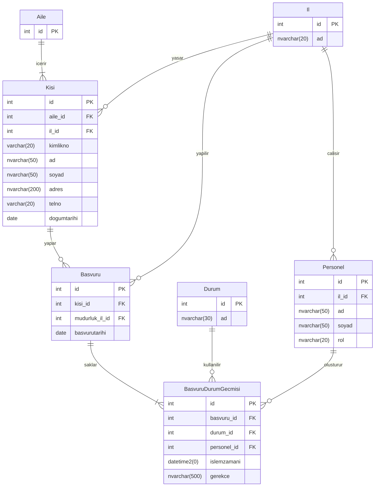

## Veri Modeli

```mermaid
erDiagram
    Basvuru ||--|{ BasvuruDurumGecmisi : saklar
    Kisi ||--o{ Basvuru : yapar
    Durum ||--o{ BasvuruDurumGecmisi : kullanilir
    Aile ||--|{ Kisi : icerir
    Il ||--o{ Kisi : yasar
    Il ||--o{ Personel : calisir
    Personel ||--o{ BasvuruDurumGecmisi : olusturur
    Il ||--o{ Basvuru : yapilir

    Il {
        int id PK
        nvarchar(20) ad
    }
    Durum {
        int id PK
        nvarchar(30) ad
    }
    Personel {
        int id PK
        int il_id FK
        nvarchar(50) ad
        nvarchar(50) soyad
        nvarchar(20) rol
    }
    Aile {
        int id PK
    }
    Kisi {
        int id PK
        int aile_id FK
        int il_id FK
        varchar(20) kimlikno
        nvarchar(50) ad
        nvarchar(50) soyad
        nvarchar(200) adres
        varchar(20) telno
        date dogumtarihi
    }
    Basvuru {
        int id PK
        int kisi_id FK
        int mudurluk_il_id FK
        date basvurutarihi
    }
    BasvuruDurumGecmisi {
        int id PK
        int basvuru_id FK
        int durum_id FK
        int personel_id FK
        datetime2(0) islemzamani
        nvarchar(500) gerekce
    }
```
